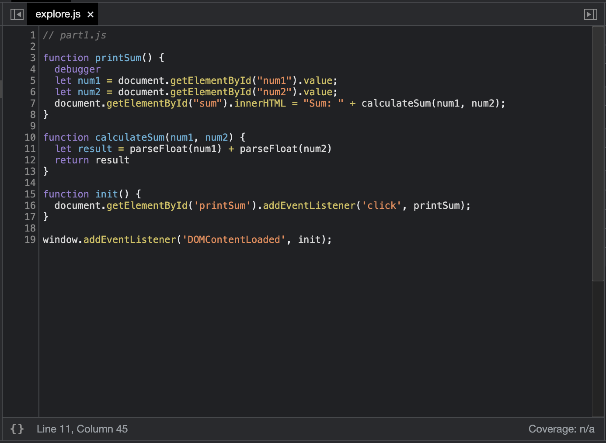

## DevTools - Debugging

1. What was the bug?
   - The input of both numbers are considered as strings. Therefore, when we try to add them together, javascript concatenate them as strings rather them adding them up as integers/numbers.
2. How would you fix it? Include a screenshot of your fix. Name it fix.png (or whatever image extension you would like to use)
    - Rather than adding ```num1``` and ```num2``` together directly, I first run ```parseFloat``` on both input to convert them into numbers, then add them together. 
    - ```let result = parseFloat(num1) + parseFloat(num2)```
    - 